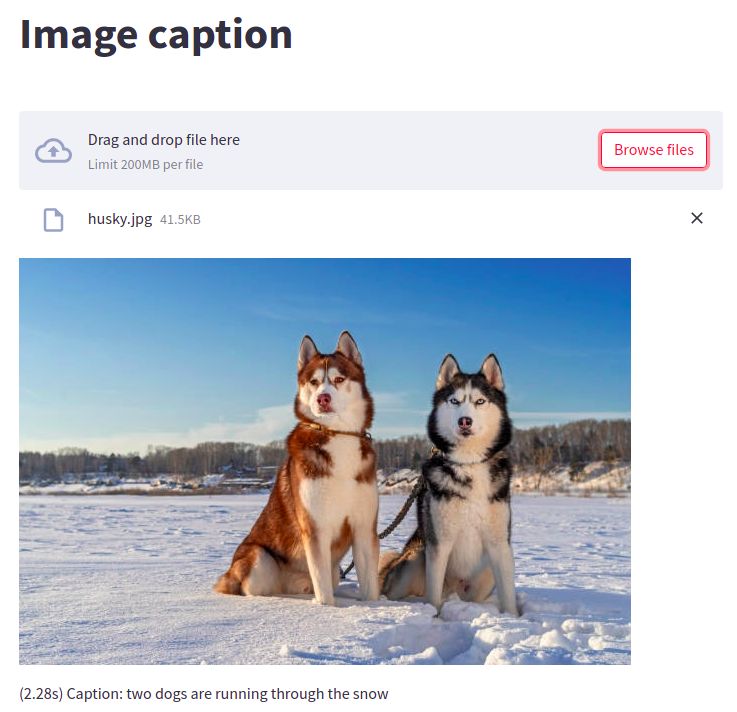

## image_caption
- Image captioning is the process of generating textual description of an image. Let’s see few applications where a solution to this problem can be very 
useful such as Self driving cars - automatic driving is one of the biggest challenges and if we can properly caption the scene around the car, it can give a 
boost to the self driving system; Automatic captioning - can help make Google search, as then every image could be first converted into a caption and then search
can be performed base on the caption; In web development, it’s good practice to provide a description for any image that appears on the page so that an image can 
be read or heard as opposed to just seen, this makes web content accessible, etc

    

## run_code
- sudo docker build -t image_caption .
- sudo docker run image_caption
